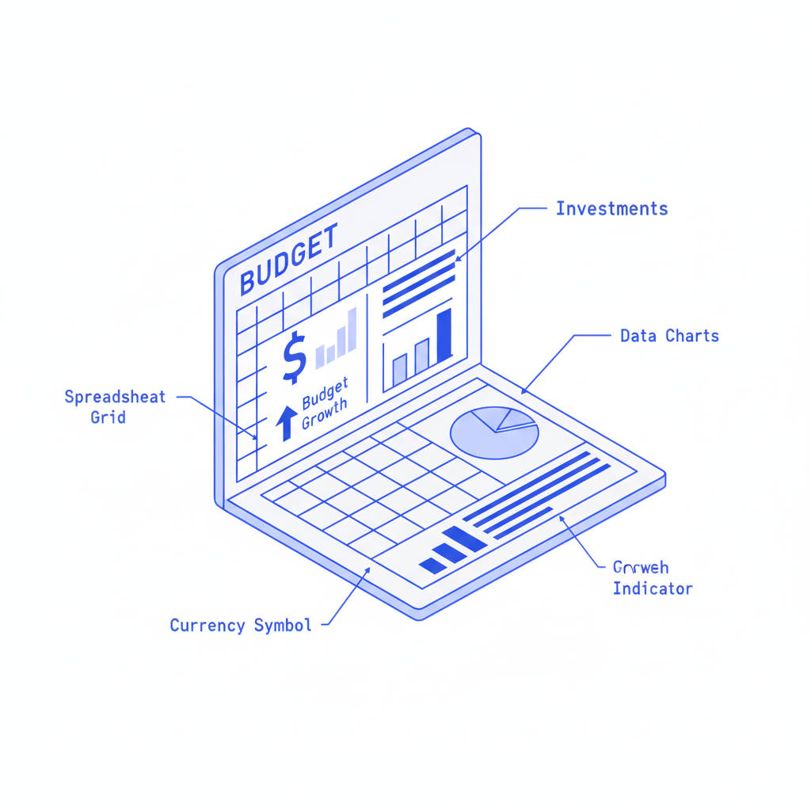
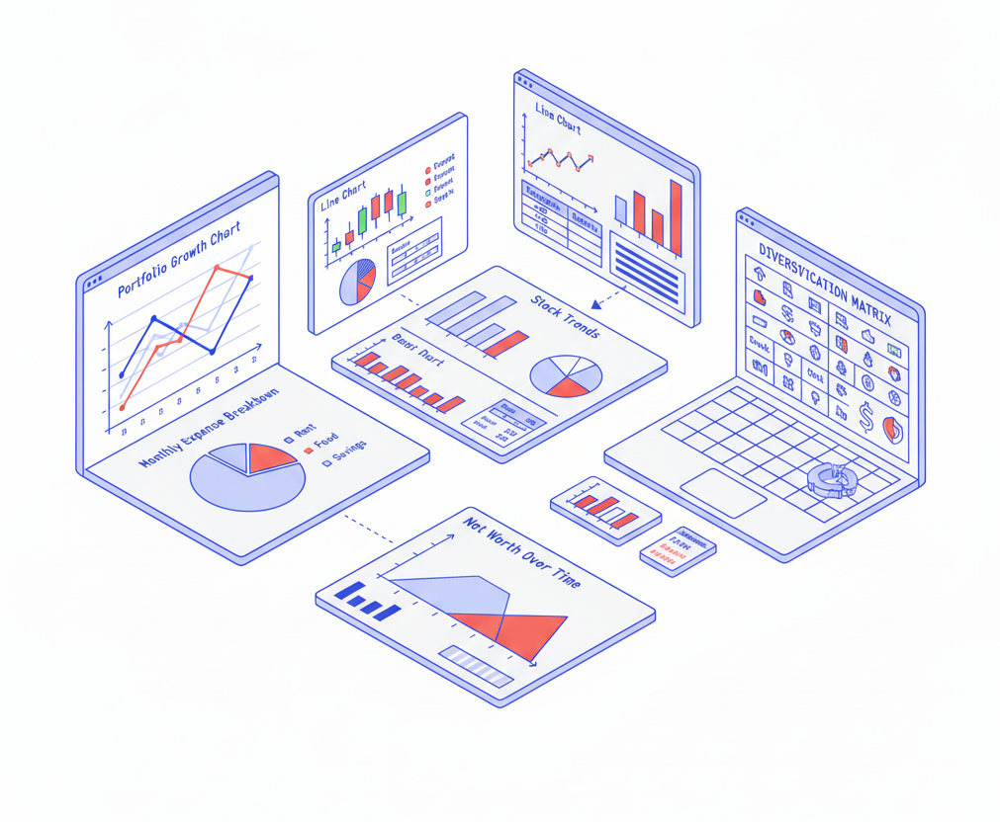
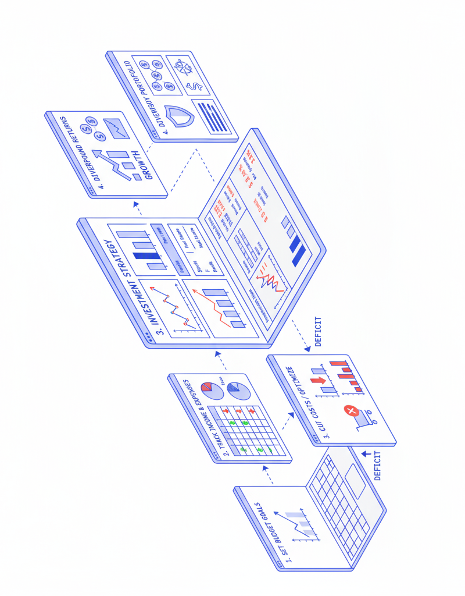

<h1>Making Budget</h1>

Stop guessing where your money goes. Start knowing

<table>
<tr>
<td width="42%" valign="top">

 

 

**Have you ever wondered** how to keep track of your finances without getting lost in complicated apps? Well, this Excel workbook has three interconnected sheets that work together seamlessly. When you track your expenses in one place, the dashboard automatically updates to show you exactly where your money is going.

 

 

Because all the data is organized in clear tables, the formulas can calculate your totals, compare them against your budget, and show you the percentage of completion. Pretty neat.

 

Or maybe you've wondered why financial planning feels so overwhelming? When you plan your budget properly, you look at all your income sources and expenses, then organize them by category to see the bigger picture.

 

 

The most effective way to understand your finances is through visual representation, meaning you can see pie charts and bar graphs that make patterns obvious. This helps you identify where you're overspending without having to analyze hundreds of numbers.

 

Maybe you've always wanted to know how to track every transaction but thought it would be too time-consuming.

 

 

The tracking sheet lets you log each transaction with date, type, category, amount, and details - creating a complete financial history that automatically updates your balance and links to your dashboard.

</td>
<td width="58%" valign="top">

 

 

But of course, life is unpredictable and your spending varies from month to month. So you have to take your planned budget and figure out how to adjust it so that it represents your actual financial situation as accurately as possible.

 

 

This is called budget tracking but it's not as simple as it seems and you need a whole bunch of clever tricks like, conditional formatting to highlight when you're over budget and running balance calculations to show your financial trajectory in real-time.

 

---

 

**If you've ever wondered** about any of these things or if you've struggled with managing your personal finances, then this is for you.

This workbook won't teach you how to get rich - it's not financial advice or an investment guide but rather something more practical than that. It's a tool that helps you understand where your money comes from and where it goes.

As our financial lives have become more complicated with subscriptions, side hustles, and investment accounts, our ability to track everything has diminished. It used to be that people kept simple ledgers but today we need comprehensive systems to stay on top of our finances.

It won't make you a millionaire tomorrow - there's nothing magical in here. But knowing where your money goes comes in handy when you're trying to save for something important. Or at the very least, you can pretend to be financially responsible in front of your friends.

 

 

 

 

 

 

**You don't need to be a spreadsheet expert** to use this - there are color-coded sections and clear charts to do the heavy lifting. You just need to be committed to tracking your expenses.

</td>
</tr>
</table>

 

  <i>A comprehensive Excel workbook for people who want to take control of their finances.</i> 

---

<b>Made with care by Giuseppe Pitruzzella</b>

